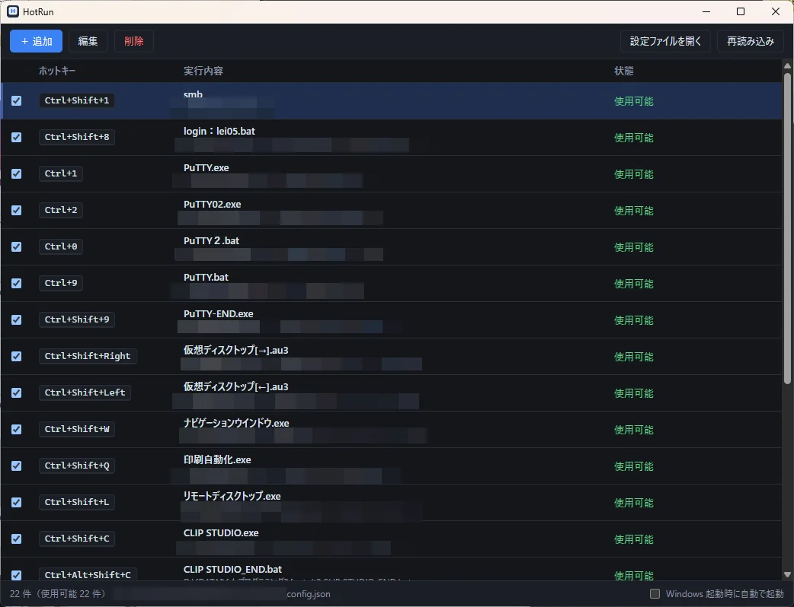
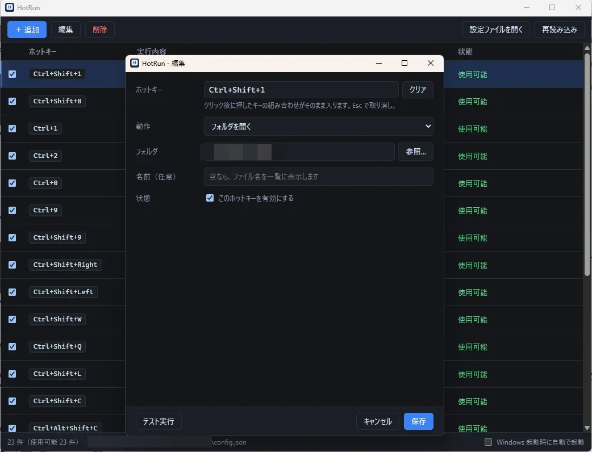
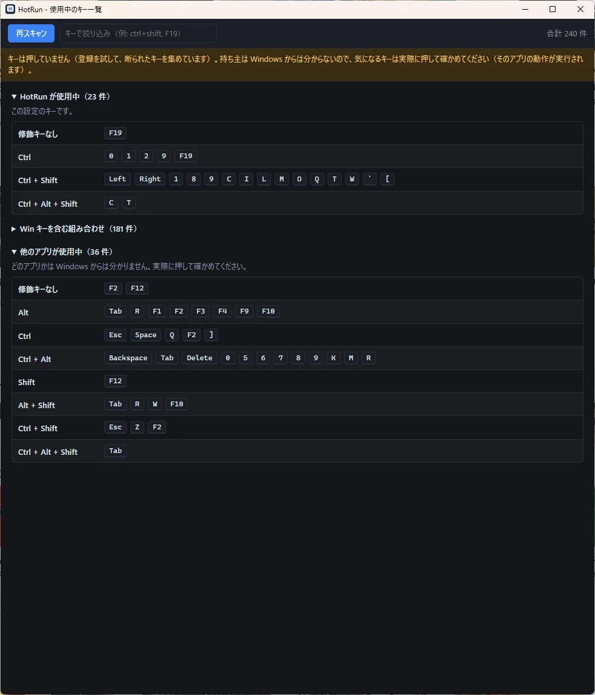

# HotRun

ホットキーでプログラム・ファイル・フォルダを開く、Windows 用のランチャー。設定は JSON 1 ファイル。

- `hotrun-app` … 設定画面とタスクトレイ常駐（普段使うのはこれ）
- `hotrun` … コマンドライン版（一覧・検査・HKLaunch の CSV 取り込み・待ち受け）

設定ファイル: `%APPDATA%\hotrun\config.json`（`--config FILE` で変更可）。画面もコマンドラインも同じファイルを使います。



## 設定画面

- 一覧: ホットキーと実行内容。チェックで有効／無効、ダブルクリックで編集ウィンドウ。
- 編集: ホットキー（欄を押してキーを押すだけ）、動作、対象、引数、作業フォルダ、ウィンドウ、名前。「テスト実行」で保存前に試せます。
- 他のアプリが使っていて取れなかったキーは、一覧に赤く出ます。同じ設定内の重複は、保存の時点で止めます。
- 一覧を閉じてもトレイに残ります。「Windows 起動時に自動で起動」は一覧の下のチェック。



## 使用中のキー一覧

「使用中のキー一覧」ボタンで、すでに誰かが取っているホットキーを洗い出します（キーは押しません。登録を試して、断られたキーを集めています）。

- HotRun 自身 / Win キーを含む組み合わせ（Windows 標準や PowerToys など）/ 他のアプリ、の 3 つに分けて、修飾キーごとに並べます。
- 持ち主のアプリ名は Windows からは分かりません。「押して確認」でキーを押すと、この画面に届けば誰も取っていない、届かなければ先約あり（反応したアプリが持ち主。そのアプリの動作は実行されます）と分かります。HotRun 自身のキーも「届かない」側に入ります（一覧の「HotRun が使用中」で見分けてください）。



## ビルド

```
cargo build --release -p hotrun-app    # target\release\hotrun-app.exe
cargo build --release -p hotrun        # target\release\hotrun.exe
```

## テスト

```
cargo test --workspace
cargo test -p hotrun-app --no-default-features   # Linux などで画面なしのロジックだけ
cd app/tests-ui && npm install && npm test && npm run test:dom
```
